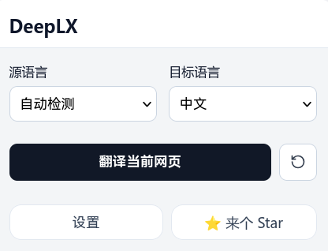
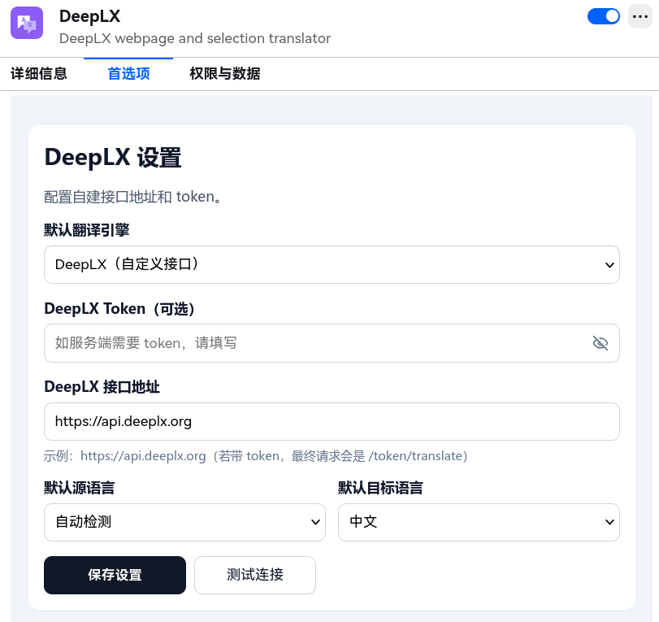

# DeepLX

> 🌐 一个简洁又不简单的浏览器翻译扩展，基于 Google Translate 与 DeepLX API，支持 Chrome / Edge / Firefox。

## ✨ 功能

- **网页翻译** — 一键替换式翻译当前页面，译文自动替换原文，支持一键恢复原文
- **划词翻译** — 选中文本后弹出毛玻璃风格的翻译气泡，原文 + 译文对照显示
- **双引擎支持** — 内置 Google Translate，并支持切换到自定义 DeepLX API
- **自定义 DeepLX 端点** — 在设置页中配置你的 DeepLX 服务地址和 Token
- **暗色模式自适应** — 翻译样式自动跟随网页配色方案

## 🖼 示例




## 📦 安装

### 从源码构建

```bash
# 安装依赖
pnpm install

# 开发模式（Chrome）
pnpm dev

# 构建并打包
pnpm zip         # Chrome
pnpm zip:edge    # Edge
pnpm zip:firefox # Firefox
pnpm zip:all     # 全部

# Firefox 上架 AMO 时建议指定唯一 Add-on ID（默认: deeplx@local）
FIREFOX_ADDON_ID="your-addon-id@example.com" pnpm zip:firefox
```

### 手动安装

1. 运行 `pnpm zip` 后，在项目根目录获得 `.zip` 文件
2. Chrome: 打开 `chrome://extensions` → 启用"开发者模式" → 拖入 `.zip` 文件
3. Firefox: 打开 `about:debugging` → "此 Firefox" → "临时载入附加组件" → 选择 `.zip` 文件

## 🛠 技术栈

- [WXT](https://wxt.dev) — 跨浏览器扩展开发框架
- [React](https://react.dev) — Popup UI
- [Google Translate](https://translate.google.com) — 默认翻译引擎
- [DeepLX](https://github.com/OwO-Network/DeepLX) — 可切换的 DeepL API 兼容引擎

## 📄 License

[MIT](https://raw.githubusercontent.com/imengying/DeepLX/refs/heads/main/LICENSE)
